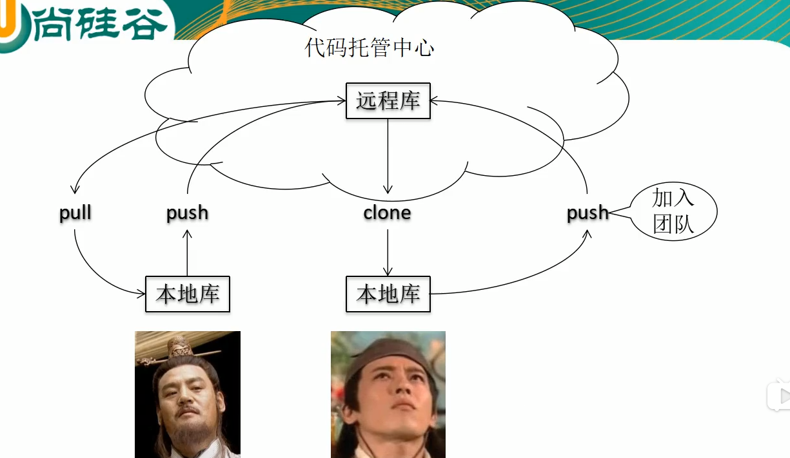
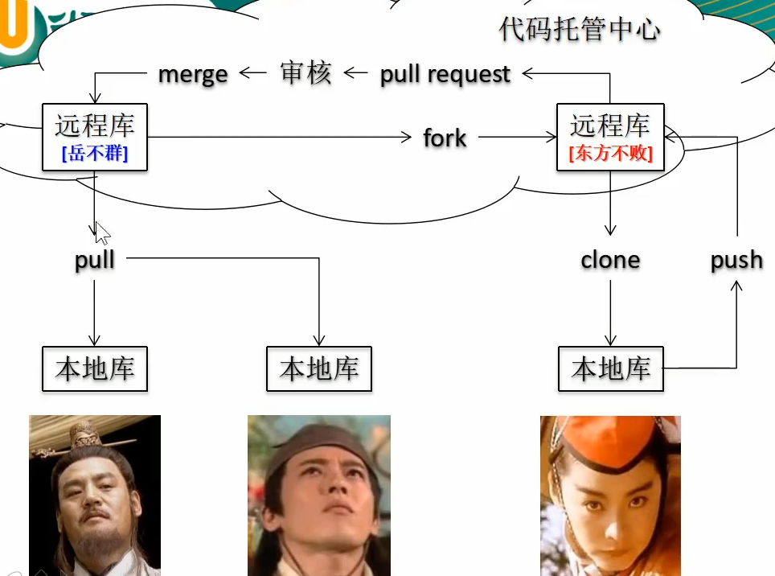

# git 学习笔记

### 0 B站地址https://www.bilibili.com/video/BV1pW411A7a5?p=44

### 1 git本地的三个区域

```
工作区			写代码的地方
git add filename
暂存区			临时存储（打算提交但没提交）
git commit
本地库			历史版本
```

### 2 本地库和远程库（github）的交互

##### 1. 团队内部协作



##### 2. 跨团队协作




### 3 git本地操作

##### 1. 本地初始化

```
文件路径下输入命令：git init
设置签名：
作用：辨别用户身份，和远程库的身份没有任何关系
命令  git config  user.name xxx   user.email xxx@xxx.com//仓库级别的(用的不多)
全局配置(更常用)：
	 git config --global user.name ""
	 git config --global user.email ""
	 git config --global --list
保存在.git/config目录下
```

##### 2. 基本操作

```
查看命令git status ，查看暂存区、工作区状态
git add filename 提交到暂存区
git commit -m "说明" filename 提交到本地仓库
```

##### 3. 版本前进和后退(本地回滚)

```
查询日志，git log --pretty=oneline 一行显示 或者--oneline
git reflog  显示转换版本需要多少步（用这个就行了）
```

```
版本选择，3种方式:
(1)哈希索引方式: git reset --hard 哈希值
(2)后退方式：git reset --hard HEAD^^^ 或者~3表示后退3步
```

##### 4. 分支管理

```
查看分支：git branch -v(都会显示所有分支)
创建分支：git branch branchName（初始内容和master一样）
切换分支：git checkout branchName
合并分支，首先需要切换到主分支（或者是要合并的分支上），git checkout master
合并分支：git merge branchName
冲突产生原因：不同分支对同一个文件都进行了修改
解决冲突：
	首先就是编辑文件，去掉特殊符号
	然后git add filename
	最后git commit -m "message"
```

### 5 github操作

```
添加远程连接地址：git remote add 别名 https://github/...
查看：git remote -v
推送：git push 别名 master(推送的分支)
克隆项目：git clone http地址
	1.完整下载
	2.创建别名
	3.初始化本地库
pull操作，git pull origin master原理：
	1.fetch:git fetch origin(别名) master抓取到本地
	2.merge:git merge origin/master（远程地址的） 与本地的master合并
```

### 6 控制面板，改变账号

`修改位置：控制面板->管理你的凭据`

### 7 ssh免密登录

```
ssh-keygen -t rsa -C 邮箱账号
进入到./ssh/id_rsa.pub
粘贴到ssh and gpg keys里面
```

```
创建别名:git remote add 别名 github的ssh

```

